# Reinforcement Learning For Soft Quadrupedal Robots

## For all background information, please see my [portfolio post](https://javtges.github.io/softquadruped/)!

 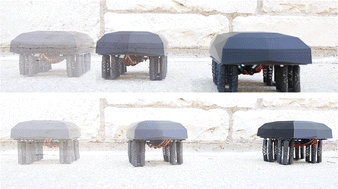 

## Table of Contents
[Background Information](#background)

[Electronics Required](#electronics-hardware-required)

[Usage Instructions](#how-to-use)

[File Descriptions](#file-descriptions)

## Background

In this project, I am working with a soft-legged quadruped, with legs composed of Handed Shearing Auxetics (HSAs). These are flexible 3D printed structures with a negative Poisson's ratio, expanding and contracting when subjected to rotation. We print HSAs out of polyurethane-like material, using stereolithography.

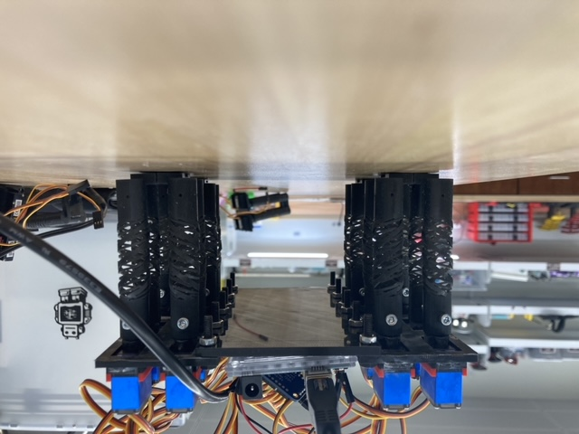

An HSA is composed of two of these auxetic cylinders. When paired together, two HSA pairs can create a structure that can expand, contract, bend, and twist.

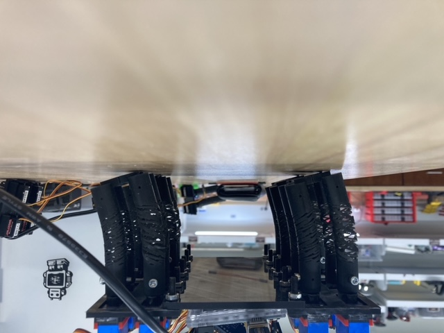

I joined the Robotic Matter Lab when Pranav Kaarthik was working with HSAs to create an quadruped. Using a hand-defined gait, he demonstrated untethered locomotion for over an hour, while carrying a payload of 1.5kg. This work appeared in "Motorized, untethered soft robots via 3D printed auxetics", accepted to Soft Matter in the Fall, and was the cover art for a themed collection on soft robotics!

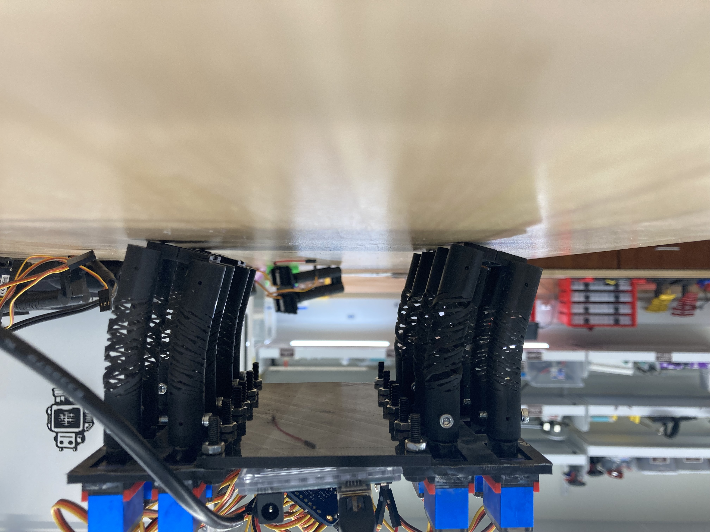

My research builds upon this foundation, establishing reinforcement learning methods applicable to such a system - with the goal of learning an optimized gait that improves the robot's walking speed.

## Electronics Hardware Required

- Ubuntu 20.04 Computer
- Teensy 4.1
  - Any microcontroller that's I2C enabled and will work with `.ino` files should work. However, realtime control on the Teensy was more robust than an Arduino Uno.
- Adafruit PCA9685 16-Channel PWM Servo Driver
- Power Supply (5v)
  - Recommended minimum 5V, 5A power supply, terminating in pigtails to be screwed into the servo driver.
- Servos (x16): [Adafruit Model 2307](https://www.adafruit.com/product/2307)
  - It's important that the servo has metal gears, to prevent teeth shearing.
  - Another reasonable option, with metal gearing and analog position feedback [Adafruit Model 1450](https://www.adafruit.com/product/1450)
- HSA Pairs (x8)
  - Unfortunately, these can only be printed by the Robotic Matter Lab for now.

## How To Use

First, install Python dependencies:
- Python Packages:
  - `gym`
  - `modern_robotics`
  - `scipy`
  - `pybullet`
  - `pyrealsense2`
  - `pupil_apriltags`
  - `numpy`
  - `csv`
  - `serial`

The mapping from servos -> servo driver channel, when looking down onto the robot, is:

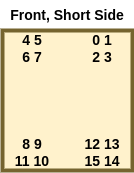

To run a trained policy, run `pmtg/gym-hsa_robot/gym_hsa_robot/run_policy.py`. You'll need to specify a policy file (saved as `.npy`) and have the `pmtg.ino` file running on the robot. It also helps if your microcontroller is plugged directly into the motherboard of the computer, rather than a USB hub (adapters are OK).

To run a policy in the simulator, run `pmtg/gym-hsa_robot/gym_hsa_robot/run_policy_pybullet.py`. You'll need to specify a policy file in the same way.

The file `pmtg/gym-hsa_robot/gym_hsa_robot/envs/hsa_robot_env2.py` determines if Pybullet runs with a GUI enabled or in headless mode.

To generate a lookup table, `inplane_sweep.ino` must be running on the robot, and the leg plugged into channels 0-3. 
Then, run the file `generate_lookup_table.py`.

To run the online reinforcement learning test (*this is not supported and not the final direction of the research project*), run `pipeline_test.py` while running the Arduino file `stone_gait_9_29.ino`.

To train a policy on Augmented Random Search, run the file `pmtg/gym-hsa_robot/gym_hsa_robot/train_ars.py`. Each epoch is saved as a `.npy` file.

## PMTG Architecture and Lookup Table Usage

To learn a gait in simulation, I use the architecture Policies Modulating Trajectory Generators. This allows the agent to learn a policy for a gait like more 'conventional' reinforcement learning, but allows some prior knowledge to be added to bootstrap the simulation. It takes the form of a periodic Trajectory Generator, which in the original paper, defines the path in space that a robot's foot follows. It's defined by various parameters, which are learned by the policy given an observation.

The policy learns additional values, too, residual values that allow the policy to modulate the Trajectory Generator's output based on an observation (Euler angles, in this case). In the original and my implementation, it takes the form of X and Y offsets for each leg. It also learns a time offset value - which modulates the phase of each leg, transitioning the Trajectory Generator into a general-purpose point selection set for each timestep within the simulation.

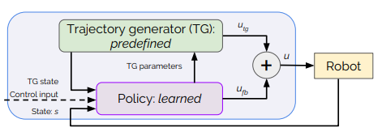

In order to improve the sim-to-real transfer effectiveness, I apply Gaussian noise to each set of simulation inputs, along with applying domain randomization for each rollout, increasing the robustness of the policy. Many implementation details are inspired by Linear Policies are Sufficient to Enable Low-Cost Quadrupedal Robots to Traverse Rough Terrain, where the application of residuals, gait time dilation, and domain randomization is critical to enable a rigid quadruped to walk and "stumble" through rough terrain without falling over.

Following this paper, I also implement a simple linear policy rather than a more complex neural network-based architecture, and use Augmented Random Search to train it. It trains in minutes on CPU, and converges on the order of only hundreds of rollouts.

The inputs of the policy are 6 dimensional: `[Roll, Pitch, Yaw, traj_width, traj_height, phase]`
The outputs of the policy are 11 dimensional: `[front_left_x_residual, front_left_y_residual, front_right_x_residual, front_right_y_residual, rear_left_x_residual, rear_left_y_residual, rear_right_x_residual, rear_right_y_residual, traj_width, traj_height, phase_offset]`.

In order to enable sim-to-real transfer, I need to tackle the challenge of forward kinematics for the HSA quadruped. I chose to accomplish this in a computationally-efficient way possible, a simple lookup table to approximate the complex mapping between motor inputs and HSA displacement.

Furthermore, to match the simulation, I constrain leg movement to planar extensions, contractions, and bending. Due to the handed nature of the legs, it means that a given HSA position can be represented by two motor commands, rather than four. Our servos that actuate the HSAs move approximately 180 degrees, so when considering 90 degrees as a nominal value, the parameter vector of motor inputs for each leg ends up being [M, 180-M, N, 180-N].

To simulate compliant behavior of the robot's legs under loading conditions similar to walking, I designed a test fixture for a single leg. Preloaded springs on each corner provide a constant force similar to one-quarter of the robot's expected weight, and allow the leg to contract without any resistive force. Extending the leg applies more force to "push the robot up".

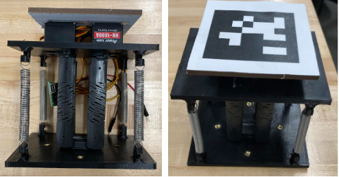

To build the test fixture, use the following BOM:
- `cad/hsa_test_fixture_top.stl`
- `cad/hsa_test_fixture_bottom.stl`
- [McMaster Springs](https://www.mcmaster.com/94135K205/)

Using an AprilTag, I then perform a set of planar sweeps to cover the parameter space for the leg. It results in a lookup table as shown below - each dot represents a combination of motor commands and the inplane displacement of the leg from the origin (0,0), when the motors are at their neutral location. In the full lookup table, compiled over multiple hours and ~12 complete inplane sweeps covering the parameter space, it's visually apparent that 1. the HSA properties remain reasonably consistent over time, and 2. HSA displacement at a given set of motor values is reasonably repeatable, regardless of the actuator's strain rate or direction of movement. The resulting dimensions of the lookup table then define the joint limits in the simulation's URDF file.

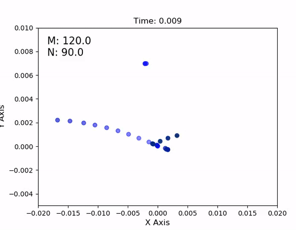

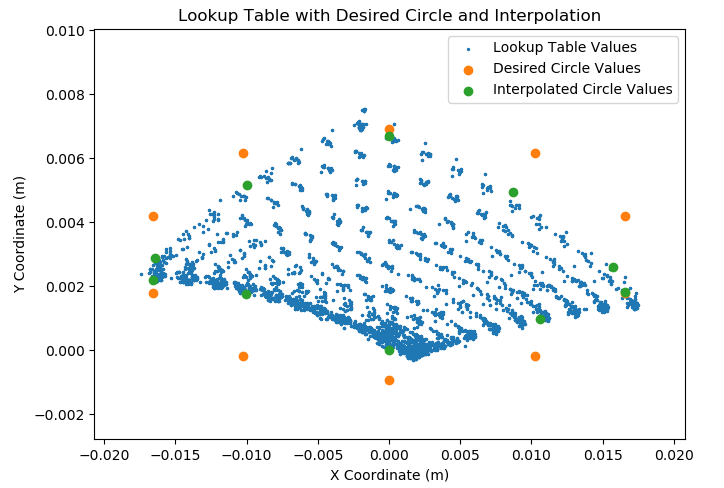

Finally, I perform bilinear interpolation to go from an arbitrary set of XY values in the leg's coordinate frame, to a set of motor commands that most closely replicate it. Appending this to the end of the PMTG pipeline allows translation of simulated policies into real life.

<!-- image of whole architecture -->
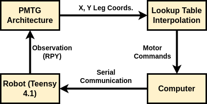

<!-- image of training results -->

Training results in a plot such as this:

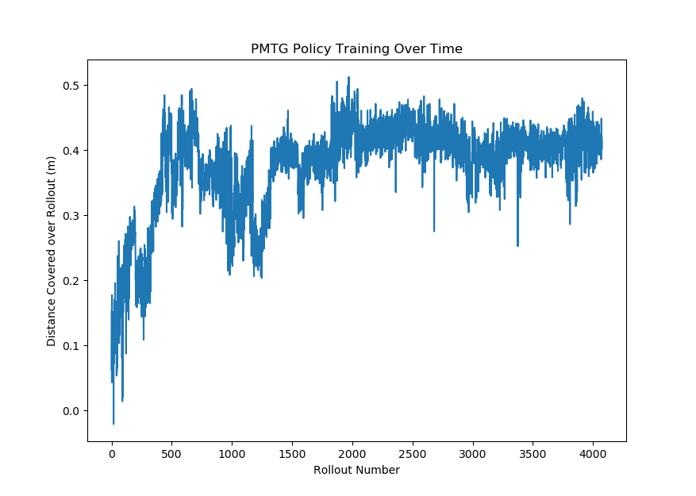

<!-- GIF of resultant gait -->
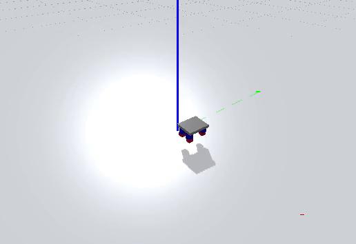

For more information, other approaches, and additional figures, see the corresponding [portfolio post](https://javtges.github.io/softquadruped/).

## File Descriptions

Here is a list of all the files in this directory. In the child directories, there are similar lists describing the usage of every executable file.

- `apriltag_test.py`: Verifies that the `pupil_apriltags` package is working correctly, only for testing purposes.
- `calculate_speed.py`: Given a CSV file, finds and plots the speed over the time of the trial. Recommended that when collecting data, it is done after the policy starts, so there's no idle time at the beginning and end of the file that will skew the measurement.
- `concatenate_csv.py`: Concatenates CSV files from `generate_lookup_table.py` into one file to be used in a lookup table or otherwise.
- `generate_lookup_table.py`: See [How to Use](#how-to-use) for details.
- `measure_speed.py`: Measures a open-loop gait, running on the robot. No serial communication required. It writes all observations to a timestamped CSV file.
- `pipeline_test.py`: See [How to Use](#how-to-use) for details.
- `plot.py`: Deprecated, plots copy-pasted values from command line.
- `speed_test.py`: Deprecated, identical to `measure_speed.py`.

Directories:

- `plot`: Contains animations, gifs, and simple utilities for plotting results.
- `logs`: Contains printouts from trainings, `.npy` policy files, and lookup table CSV files.
- `cad`: Contains the CAD for the HSA testing fixture.
- `pmtg/gym-hsa_robot/gym_hsa_robot/`: Contains the files to train the HSA robot via ARS, the Pybullet & gym environment, and all related materials.