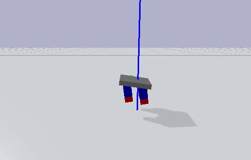

# Gym and Pybullet Environment for HSA Robot

## File Descriptions

In the directory `gym_hsa_robot`:

- `serial_test.py`: Verifies serial communication functionality between Arduino/Teensy and the computer.
- `env_test.py`: Verifies the environment's functionality.
- `run_policy_pybullet.py`: Runs a policy in pybullet to test. See [How-To](../../README.md/#how-to-use) for more information.
- `run_policy.py`: Runs a policy in on a HSA robot. See [How-To](../../README.md/#how-to-use) for more information.
- `train_ars.py`: Trains Augmented Random Search on a HSA robot in simulation. See [How-To](../../README.md/#how-to-use) for more information.

In the directory `gym_hsa_robot/envs`:

-`hsa_robot_env2.py`: This is the primary environment for the HSA robot Gym environment. Here is where you can change from `p.GUI` to `p.DIRECT`.

In the directory `gym_hsa_robot/resources`:

- `circular_gait.py`: Runs and displays a default circular gait in Pybullet.
- `hsa_robot.py`: This is the primary environment for the HSA Pybullet Environment. It contains information about joint limits, force exertion, observations, and inputs to the system.
- `hsa_turtle_test.urdf`: The URDF file for the system. This is AUTOGENERATED, DON'T EDIT IT!
- `hsa_turtle.xacro`: This is what defines the robot's model - dimensions, weights, joint limits, joint dampings, and more. In order to convert it from a xacro to a URDF, run the command `xacro hsa_turtle.xacro > hsa_turtle_test.urdf`.
- `lookup_table_test.py`: Verifies that the lookup table and trajectory generator is working properly. Plots the lookup table with a circular gait path superimposed on it.
- `lookup_table_utils.py`: Contains the LookupTable class, along with all of the helper functions within.
- `plane.py`: This is the class for the plane that defines the ground of the simulator.
- `pybullet_test.py`: Runs arbitrary commands on the HSA robot, to verify that everything is working properly.
- `simpleplane.urdf`: Defines the ground for the simulator.
- `trajectory_generation_testing.ipynb`: Tests the trajectory generation. Deprecated in favor of `lookup_table_test.py`.
- `trajectory_generator_class`: Contains the class for the Trajectory Generator.
- `trajectory_generator.py`: Contains various methods, helper functions, and tests for the trajectory generation. Deprecated.